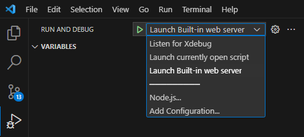

## DEV CONTAINER FOR PHP 8.1 WITH XDEBUG 3.2.1

### Description

This is a dev container for PHP 8.1 with Xdebug 3.2.1. It was created with the help of the [VS Code Remote Containers](https://code.visualstudio.com/docs/remote/containers) extension and the goal is to spped up the development process by providing a ready to use environment.

### Usage

1. Clone this repository
2. Open the project in VS Code
3. Install the [VS Code Remote Containers](https://code.visualstudio.com/docs/remote/containers) extension
4. Open the command palette and select `Remote-Containers: Reopen in Container`
5. Wait for the container to build
6. Open a terminal in VS Code and run `cd php/src && php -S localhost:8080`
7. Open a browser and navigate to `localhost:8080`

### Debugging

The image bellow display the 3 debuging options configured in the `launch.json` file. The first option is to debug using and outside tool. The second option is to debug a single file. The third option is to start the embedded web server and debug the entire project.

### TODO

- ~~Create a sample test suite~~
- improve this documentation